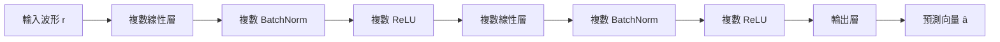
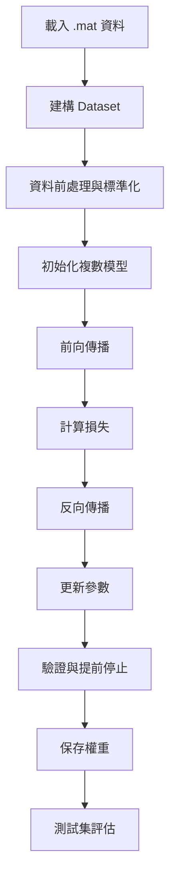

# CVNN：複數波形回歸測試

## 1. 專案簡介

本專案測試一個典型的複數值回歸任務：給定接收端觀測到的一段複數波形 $\mathbf{r} \in \mathbb{C}^{L}$，模型需要預測對應的複數目標向量 $\mathbf{a} \in \mathbb{C}^{D}$。其中輸入長度為 $L=12000$，輸出維度為 $D=33$。

我們希望學習一個映射函數

$$
\hat{\mathbf{a}} = f_{\theta}(\mathbf{r})
$$

使輸出向量 $\hat{\mathbf{a}}$ 儘可能接近真實標註 $\mathbf{a}$。

這個問題可視為一個「由波形到參數」的監督式回歸問題，並具有複數輸入、複數輸出與雜訊干擾等特性。

---

## 2. 實驗參數與其意義

| 類別 | 參數 | 設定值 | 代表意義 |
| --- | --- | --- | --- |
| 輸入長度 | $L$ | 12000 | 每筆輸入波形包含 12000 個時間點(取樣點)，代表模型一次要處理的高維複數訊號長度。此數字直接決定第一層線性層的輸入維度。 |
| 輸出維度 | $D$ | 33 | 模型要預測的複數目標向量長度。每一維都對應一個要回歸的複數參數。 |
| 訓練樣本數 | $N_{\mathrm{train}}$ | 最多 3000 | 用於學習的訓練樣本上限。樣本越多，模型越容易學到穩定的映射關係，但計算成本也會增加。 |
| 測試樣本數 | $N_{\mathrm{test}}$ | 1500 | 用於最終評估的未見過資料數量。這些樣本不參與訓練，能更真實地反映泛化能力。 |
| SNR 條件 | | $\{0,5,10,15,20,25\}$ dB | 訊雜比設定，數字越小表示雜訊越強、任務越困難。模型在不同 SNR 下都要維持良好的重建能力。 |
| 批次大小 | $B$ | 256 | 每次更新參數時一次處理的樣本數。較大批次可使梯度更穩定，但會消耗更多記憶體。 |
| 訓練輪數 | $E$ | 25（預設） | 完整遍歷整個訓練集的次數。過多輪數可能導致過擬合，過少則可能不足以收斂。 |
| 學習率 | $\eta$ | $2 \times 10^{-4}$ | 優化器每一步更新參數的步長。過大容易震盪，過小則收斂緩慢。 |
| 權重衰減 | $\lambda$ | $1 \times 10^{-5}$ | L2 正則化強度，用來抑制參數過大、降低過擬合的風險。 |
| 驗證集比例 | | 0.1 | 從訓練資料中保留 10% 作為驗證集，用來監測是否出現過擬合並決定提前停止。 |
| 隨機種子 | | 42 | 固定隨機種子，確保每次實驗在相同條件下可重現。 |

---

## 3. 輸入輸出定義

輸入訊號為一個長度為 $L$ 的複數向量：

$$
\mathbf{r} = [r_1, r_2, \dots, r_L] \in \mathbb{C}^{L}
$$

輸出為一個 $D$ 維複數向量：

$$
\mathbf{a} = [a_1, a_2, \dots, a_D] \in \mathbb{C}^{D}
$$

其中 $L=12000$、$D=33$。

目標是學習參數化函數 $f_{\theta}$，使得

$$
\|\hat{\mathbf{a}} - \mathbf{a}\|_2
$$

盡可能小。

---

## 4. 數學建模

### 4.1 複數表示

任一複數值可表示為

$$
z = x + jy
$$

其中 $x = \Re(z)$ 是實部，$y = \Im(z)$ 是虛部，$j$ 為虛數單位。對長度為 $L$ 的複數波形而言，可寫成

$$
\mathbf{r} = [r_1, r_2, \dots, r_L]^\top,
\quad r_l \in \mathbb{C}
$$

實作時，模型並不是把複數簡化成單一實值，而是保留實部與虛部的雙通道結構，讓模型同時學習幅度與相位資訊。

### 4.2 輸入與輸出映射
模型的核心是學習一個複數回歸映射：

$$
f_{\theta}: \mathbb{C}^{12000} \rightarrow \mathbb{C}^{33}
$$

也就是將接收波形 $\mathbf{r}$ 映射成目標向量 $\mathbf{a}$ 的估計值 $\hat{\mathbf{a}}$。這裡的 $\theta$ 代表所有可訓練參數，包括複數線性層、複數批次正規化層與偏置項。

### 4.3 訊號模型

資料生成過程可建模為

$$
\mathbf{r} = \mathbf{s} + \mathbf{n}
$$

其中 $\mathbf{s}$ 表示理想訊號，$\mathbf{n}$ 表示加性高斯雜訊。這個假設的意義在於：模型不能只記住乾淨訊號的模式，還必須學會在雜訊干擾下恢復潛在結構，因此輸入端的魯棒性非常重要。

### 4.4 複數線性層

模型的基本運算單元是複數線性層，其形式可寫為

$$
\mathbf{z} = \mathbf{W}\mathbf{x} + \mathbf{b}
$$

其中 $\mathbf{W} \in \mathbb{C}^{M\times N}$、$\mathbf{x} \in \mathbb{C}^{N}$、$\mathbf{b} \in \mathbb{C}^{M}$。這裡的線性變換會同時對實部與虛部進行耦合，而不是各自獨立處理，因此可以捕捉複數訊號中更完整的相關性。

### 4.5 複數正規化與非線性

為了提升訓練穩定性，模型使用複數批次正規化。其做法是先計算批次平均值，再以複數幅度的變異量做標準化，避免不同特徵維度的尺度差異影響優化過程。概念上可視為

$$
\widetilde{\mathbf{x}} = \frac{\mathbf{x} - \mu}{\sqrt{\sigma^2 + \epsilon}}
$$

其中 $\mu$ 為批次平均，$\sigma^2$ 為複數幅度對應的方差，$\epsilon$ 為數值穩定項。非線性部分則對實部與虛部分別施加 ReLU，使模型在保持複數結構的同時，也具備非線性表達能力。

### 4.6 損失函數

訓練時使用加權損失函數：

$$
\mathcal{L}
= 0.7\,\mathrm{MSE}(\Re(\hat{\mathbf{a}}),\Re(\mathbf{a}))
+ 0.7\,\mathrm{MSE}(\Im(\hat{\mathbf{a}}),\Im(\mathbf{a}))
+ 0.2\,\mathrm{MSE}(|\hat{\mathbf{a}}|,|\mathbf{a}|)
+ 0.1\,\mathrm{MAE}(\hat{\mathbf{a}},\mathbf{a})
$$

這個設計同時約束實部、虛部與幅度，提升模型在複數域中的學習效果。各項權重的含義如下：

- 實部與虛部誤差權重各為 0.7：確保相位資訊與直角座標表達都能被學到
- 幅度誤差權重為 0.2：讓模型不只追求分量對齊，也關注整體能量分布
- 平均絕對誤差權重為 0.1：提供更穩健的懲罰，降低少數極端值對訓練的影響

在評估時，除了 MSE 與 MAE，也會觀察 RMSE、EVM 與相關係數，分別反映平均誤差、誤差尺度、訊號失真程度與幅度一致性。

---

## 5. 資料集與前處理

### 5.1 資料集內容

每筆樣本包含三個主要欄位：

- `rx`：接收訊號（複數波形）
- `a`：目標向量（複數）
- `snr`：對應訊雜比

### 5.2 資料來源

資料由 [ml.py](ml.py) 生成，並由 [train.py](train.py) 載入。資料涵蓋多個 SNR 等級，包括：

- 0 dB
- 5 dB
- 10 dB
- 15 dB
- 20 dB
- 25 dB

### 5.3 前處理

訓練前，模型會對輸入與目標的實部與虛部分別進行標準化，避免不同特徵尺度造成訓練不穩定。

---

## 6. 模型架構

有別於將複數化為實數做處理的MLP，本專案將採用複數值神經網路 `torch.complex64` 。

### 6.1 架構圖



### 6.2 模型層次

模型由以下部件組成：

- `ComplexLinear`：複數線性層
- `ComplexBatchNorm1d`：複數批次正規化
- `ComplexReLU`：複數域中的非線性激活

其隱藏維度為：

$$
12000 \rightarrow 384 \rightarrow 192 \rightarrow 33
$$

這種設計能自然保留複數訊號中的振幅與相位資訊。對應到整體前向傳播流程，可表示為：

$$
\hat{\mathbf{a}} = f_{\theta}(\mathbf{r}) = L_3(\phi(B_2(L_2(\phi(B_1(L_1(\mathbf{r})))))))
$$

其中 $L_k$ 表示複數線性層，$B_k$ 表示複數批次正規化，$\phi$ 表示複數 ReLU。這個分層設計的作用如下：

- 第一層把高維輸入壓縮成較低維的抽象表示，降低原始波形的冗餘
- 中間層進一步提取與目標向量相關的複數特徵
- 最後一層直接輸出 $33$ 維複數預測值

相較於直接使用單層線性回歸，這種多層結構能夠學到更非線性的訊號到參數映射。

---

## 7. 訓練流程與 workflow

### 7.1 Workflow 圖



### 7.2 訓練流程

1. 讀入 MATLAB 格式資料
2. 建構訓練集與驗證集
3. 對輸入與目標做標準化
4. 初始化複數模型
5. 進行前向傳播與損失計算
6. 反向傳播與參數更新
7. 使用驗證集檢查收斂情況
8. 最終保存最佳權重並進行測試評估

### 7.3 訓練策略說明

訓練階段的設計重點不是單純讓損失下降，而是讓模型在複數資料上穩定收斂。具體來說：

- `AdamW` 同時提供自適應更新與權重衰減，適合這類高維非線性回歸問題
- `CosineAnnealingLR` 會隨 epoch 漸進降低學習率，使前期探索更快、後期收斂更穩
- 驗證集比例 0.1 用來監控泛化能力，避免訓練集上表現變好但測試集退化
- 提前停止策略會在驗證損失連續多輪未改善時停止訓練，以避免過擬合與無效計算
- 參數梯度會做額外的尺度正規化，降低某些複數參數梯度過大的風險，讓更新步伐更一致

### 7.4 資料載入與批次設定

訓練時使用 mini-batch 方式更新參數，批次大小設為 256，主要考量如下：

- 可在梯度穩定性與記憶體使用量之間取得平衡
- 讓每次更新看到足夠多的樣本，減少單筆資料噪聲造成的震盪
- 在 GPU 環境下可提升吞吐量與整體訓練效率

`num_workers` 則控制 DataLoader 的平行載入數量；若使用 GPU，通常可透過較高的 worker 數加快資料供應速度。

### 7.5 模型保存與評估

訓練過程中會保存驗證損失最低的權重，而不是最後一輪的權重。這樣做的原因是：最後一輪不一定是泛化效果最好的狀態。測試階段則重新載入最佳 checkpoint，對未見資料計算 MSE、MAE、RMSE、EVM 與相關係數，作為最終報告依據。

---

## 8. 輸入輸出 API

### 8.1 輸入

```python
x: torch.Tensor
```

- 形狀：`[batch_size, 12000]`
- 類型：`torch.complex64`
- 含義：一批接收波形樣本

### 8.2 輸出

```python
y: torch.Tensor
```

- 形狀：`[batch_size, 33]`
- 類型：`torch.complex64`
- 含義：對應的目標向量預測值

### 8.3 推論範例

```python
import torch
from train import WaveformRegressor

model = WaveformRegressor(12000, 33)
x = torch.randn(2, 12000, dtype=torch.complex64)
y = model(x)
print(y.shape)
print(y.dtype)
```

---

## 9. 實驗結果

在 1500 個測試樣本上的最新結果如下：

| 指標 | 數值 |
| --- | ---: |
| Average MSE | 0.030337 |
| Average MAE | 0.109154 |
| Average RMSE | 0.123704 |
| Average EVM (dB) | -19.97 dB |
| Correlation | 0.767656 |

這些結果顯示模型已具備可觀的重建能力，能在目前的合成資料設定下較穩定地估計目標向量。

---


### 10 模型與訓練超參數的作用

- 隱藏維度 384 與 192：分別代表兩個中間層的神經元數量。維度越大，模型表示能力越強，但計算與記憶體需求也會增加。
- `ComplexBatchNorm1d` 的 $\epsilon = 10^{-5}$：用於數值穩定，避免分母接近 0。它讓複數特徵在批次內保持較穩定的尺度。 
- `ComplexBatchNorm1d` 的動量 $0.9$：控制歷史統計量更新的平滑程度，讓正規化統計在訓練過程中更穩定。 
- `ComplexReLU`：在實部與虛部上分別施加非線性激活，允許模型建模更複雜的複數域關係。 
- 損失函數中的權重 $0.7, 0.7, 0.2, 0.1$：分別強調實部誤差、虛部誤差、振幅誤差與絕對誤差。這樣的設計是為了讓模型同時關注相位與振幅資訊。 
- `AdamW` 優化器：使用自適應學習率與權重衰減，對深度網路通常比普通 SGD 更穩定且收斂更快。 
- `CosineAnnealingLR`：讓學習率隨訓練輪數呈餘弦衰減，前期維持較快進步，後期逐步收斂，降低震盪。 
- 提前停止策略 `patience = 5`：若驗證損失連續 5 輪沒有改善，就停止訓練，避免無效訓練與過擬合。 
- 標準化統計量 `mean/std`：在訓練前對輸入與輸出做正則化，讓不同尺度的特徵不會互相掩蓋，提高優化穩定性。 
- `num_workers`：資料載入的多執行緒數量，數值越大通常資料讀取越快，但也可能增加系統負擔。 


這些設定的設計目的是為了在複數波形回歸任務中取得較好的穩定性與可重現性：

1. 輸入與輸出維度與資料本身相匹配，避免資訊瓶頸。 
2. 使用標準化與批次正規化，降低不同特徵尺度對訓練的影響。 
3. 損失函數同時約束實部、虛部與幅度，讓模型更貼近複數值回歸的本質。 
4. 透過驗證集與提前停止，避免在有限資料下出現過擬合。 
5. 固定隨機種子與可重現設定，讓結果更容易比較與驗證。 

---

## 11. 專案結構

```text
ML/
├── ml.py
├── train.py
├── README.md
├── checkpoint/
└── data/
```

- [ml.py](ml.py)：生成複數波形資料集
- [train.py](train.py)：載入資料、訓練模型並進行評估
- [README.md](README.md)：專案說明與實驗記錄
- [checkpoint](checkpoint)：模型權重檔案
- [data](data)：生成的 MATLAB 資料檔

---

## 12. 執行方式

### 生成資料

```bash
python ml.py
```

### 訓練與評估

```bash
python train.py
```

也支援命令列參數，例如：

```bash
python train.py --epochs 25 --batch-size 256 --max-samples 3000 --test-samples 1500
```

---

## 13. 限制與未來方向

目前仍有幾個值得進一步探索的方向：

- 目前資料為合成資料，尚未驗證於實際量測資料
- 模型結構仍以簡單的多層感知機為主
- 未來可進一步研究不同 SNR 條件下的泛化能力與魯棒性
- 也可以嘗試引入複數多層感知機（Complex MLP）或 複數卷積網路（Complex CNN）以提升性能。

---

