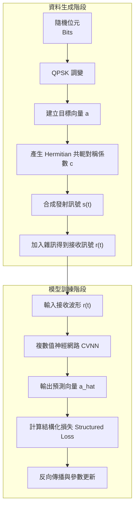
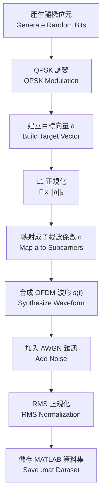
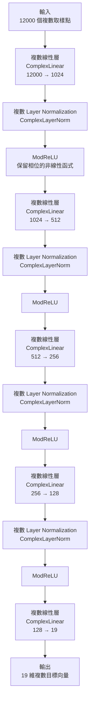
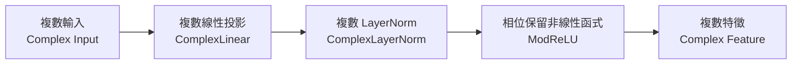
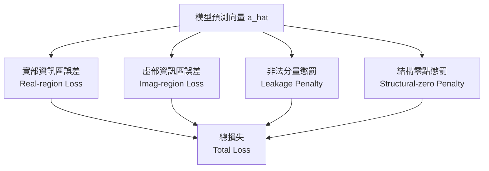
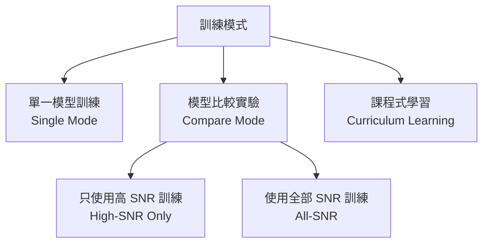

<div align="center">

# 基於複數值神經網路（Complex-Valued Neural Network, CVNN）的結構化 OFDM 波形回歸


**本研究利用複數值神經網路，從接收端複數波形中直接回歸結構化目標向量。**

</div>

---

## 目錄

- [1. 專案簡介](#1-專案簡介)
- [2. 研究動機](#2-研究動機)
- [3. 本階段研究重點](#3-本階段研究重點)
- [4. 系統整體架構](#4-系統整體架構)
- [5. 訊號模型](#5-訊號模型)
- [6. 資料集生成流程](#6-資料集生成流程)
- [7. 目標向量 Target Vector 結構](#7-目標向量-target-vector-結構)
- [8. Hermitian 共軛對稱設計](#8-hermitian-共軛對稱設計)
- [9. OFDM 時域訊號合成](#9-ofdm-時域訊號合成)
- [10. 資料格式](#10-資料格式)
- [11. CVNN 神經網路架構](#11-cvnn-神經網路架構)
- [12. 核心複數神經網路函式](#12-核心複數神經網路函式)
- [13. 結構化損失函數 Structured Loss 設計](#13-結構化損失函數-structured-loss-設計)
- [14. 訓練策略](#14-訓練策略)
- [15. 評估指標](#15-評估指標)
- [16. 實驗結果與初步觀察](#16-實驗結果與初步觀察)
- [17. 專案檔案結構](#17-專案檔案結構)
- [18. 執行方式](#18-執行方式)
- [19. 待完成工作](#19-待完成工作)

---

# 1. 專案簡介

本專案建立一套 **Hermitian-Symmetric OFDM（共軛對稱正交分頻多工）** 合成資料集，並使用  
**Complex-Valued Neural Network（複數值神經網路，CVNN）** 對接收端複數波形進行回歸。

模型學習的映射為：

$$
f_\theta: \mathbb{C}^L \rightarrow \mathbb{C}^D
$$

其中：

$$
L = 12000, \qquad D = 19
$$

也就是說，模型輸入為一段長度 12000 的複數接收波形，輸出為一個長度 19 的複數目標向量。

---

本研究與一般實數神經網路不同，主要保留複數訊號的表示：

$$
r(t) = r_I(t) + j r_Q(t)
$$

其中：

- `r_I(t)`：接收訊號實部
- `r_Q(t)`：接收訊號虛部
- $j$：虛數單位

由於通訊訊號本質上通常包含幅度與相位資訊，因此本專案採用pytorch中複數專用的函式並搭配傳統多層感知器（Multilayer Perceptron, MLP）實作。

---

# 2. 研究動機

傳統 OFDM 接收端通常需要執行多個訊號處理步驟：

```text
接收訊號
    │
    ▼
通道估測（Channel Estimation）
    │
    ▼
等化（Equalization）
    │
    ▼
符號判決（Symbol Detection）
    │
    ▼
資料還原
```

這些方法通常依賴明確的通道模型、導頻（Pilot）設計與估測演算法。

---

本研究的核心問題是：

> 是否可以讓神經網路直接學習從接收波形到目標參數的反向映射？

也就是：

$$
\mathbf{r} \longrightarrow \hat{\mathbf{a}}
$$

其中：

- `r`：接收端觀測到的複數波形
- $\hat{\mathbf{a}}$：模型預測出的結構化目標向量

---

本研究目前並不是要直接取代所有傳統通訊演算法，而是希望先驗證流程：

1. 複數值神經網路（CVNN）是否能有效學習複數波形中的結構資訊。
2. Hermitian-Symmetric OFDM 訊號是否能建立穩定的監督式學習問題。
3. 結構化損失函數（Structured Loss）是否能提升目標向量回歸品質。
4. 多訊雜比（Signal-to-Noise Ratio, SNR）條件下，模型是否具有泛化能力。

---

# 3. 本階段研究重點

本階段的重點不是建立完整通訊接收機，而是建立一個可控的實驗平台。

目前完成的主要工作如下：

| 項目 | 狀態 | 說明 |
|---|---|---|
| Hermitian-Symmetric 資料生成 | 已完成 | 由 `generate_dataset.py` 產生 |
| QPSK 位元映射 | 已完成 | 使用 QPSK 星座點 |
| 結構化目標向量 | 已完成 | `D = 19`，中間 index 固定為 0 |
| OFDM 波形合成 | 已完成 | 產生長度 `L = 12000` 的波形 |
| AWGN 雜訊通道 | 已完成 | 支援多組 SNR |
| CVNN 訓練程式 | 已完成初版 | 使用 `train.py` |
| 結構化損失函數 | 已完成初版 | 對應 target vector 結構 |
| 課程式學習（Curriculum Learning） | 初步支援 | 從高 SNR 到全 SNR |

---

# 4. 系統整體架構

整體流程如下圖所示。


```mermaid
flowchart LR
    A["隨機位元<br/>Random Bits"] 
    --> B["QPSK 調變<br/>Gray-coded QPSK"]
    --> C["結構化目標向量 a<br/>Structured Target Vector"]
    --> D["Hermitian 共軛對稱映射<br/>Hermitian Mapping"]
    --> E["子載波係數 c<br/>Subcarrier Coefficients"]
    --> F["OFDM 訊號合成<br/>OFDM Synthesis"]
    --> G["加入 AWGN 雜訊<br/>AWGN Channel"]
    --> H["接收波形 r(t)<br/>Received Waveform"]
    --> I["複數值神經網路<br/>CVNN"]
    --> J["預測目標向量 a_hat<br/>Estimated Target"]
```

**圖一：系統整體流程圖**

---

從資料生成到模型訓練，可以分成兩個階段：


```mermaid
flowchart TD
    subgraph A["資料生成階段"]
        A1["隨機位元<br/>Bits"] 
        --> A2["QPSK 調變"]
        --> A3["建立目標向量 a"]
        --> A4["產生 Hermitian 共軛對稱係數 c"]
        --> A5["合成發射訊號 s(t)"]
        --> A6["加入雜訊得到接收訊號 r(t)"]
    end

    subgraph B["模型訓練階段"]
        B1["輸入接收波形 r(t)"] 
        --> B2["複數值神經網路 CVNN"]
        --> B3["輸出預測向量 a_hat"]
        --> B4["計算結構化損失 Structured Loss"]
        --> B5["反向傳播與參數更新"]
    end

    A6 --> B1
```

**圖二：資料生成與模型訓練流程**

---

# 5. 訊號模型

本專案採用加性白高斯雜訊模型（Additive White Gaussian Noise, AWGN）：

$$
r(t) = s(t) + n(t)
$$

其中：

| 符號 | 意義 |
|---|---|
| `s(t)` | 發射端乾淨訊號 |
| `n(t)` | 加性白高斯雜訊（AWGN） |
| `r(t)` | 接收端訊號 |

---

離散時間表示為：

$$
r[\ell] = s[\ell] + n[\ell], \qquad \ell = 0,1,\dots,L-1
$$

其中：

$$
L = 12000
$$

---

神經網路的任務是根據整段接收波形：

$$
\mathbf{r} = [r[0], r[1], \dots, r[L-1]]^T \in \mathbb{C}^{12000}
$$

回歸目標向量：

$$
\mathbf{a} = [a_0, a_1, \dots, a_{18}]^T \in \mathbb{C}^{19}
$$

---

因此，模型目標為：

$$
\hat{\mathbf{a}} = f_\theta(\mathbf{r})
$$

並希望：

$$
\hat{\mathbf{a}} \approx \mathbf{a}
$$

---

# 6. 資料集生成流程

資料集由 `generate_dataset.py` 生成。

主要參數如下：

| 參數 | 設定值 | 說明 |
|---|---:|---|
| $N$ | 20 | 子載波數參數 |
| $D$ | 19 | 目標向量維度 |
| $M$ | 4 | QPSK |
| $F_s$ | 3 MHz | 取樣頻率 |
| $\Delta f$ | 250 Hz | 子載波間隔 |
| $T_{sym}$ | 4 ms | 符號週期 |
| $L$ | 12000 | 每個符號的取樣點 |
| SNR | 0,5,10,15,20,25 dB | 訊雜比 |
| samples/SNR | 3000 | 每個 SNR 的樣本數 |

---

資料生成流程如下：


```mermaid
flowchart TD
    A["產生隨機位元<br/>Generate Random Bits"]
    --> B["QPSK 調變<br/>QPSK Modulation"]
    --> C["建立目標向量 a<br/>Build Target Vector"]
    --> D["L1 正規化<br/>Fix ||a||₁"]
    --> E["映射成子載波係數 c<br/>Map a to Subcarriers"]
    --> F["合成 OFDM 波形 s(t)<br/>Synthesize Waveform"]
    --> G["加入 AWGN 雜訊<br/>Add Noise"]
    --> H["RMS 正規化<br/>RMS Normalization"]
    --> I["儲存 MATLAB 資料集<br/>Save .mat Dataset"]
```

**圖三：資料集生成流程**

---

輸出資料會依照 SNR 分成多個 `.mat` 檔案：

```text
data1/
├── dataset_SNR_00dB.mat
├── dataset_SNR_05dB.mat
├── dataset_SNR_10dB.mat
├── dataset_SNR_15dB.mat
├── dataset_SNR_20dB.mat
└── dataset_SNR_25dB.mat
```

---

# 7. 目標向量 Target Vector 結構

本專案的目標向量（Target Vector）並不是一般任意複數向量，而是具有固定結構。

$$
\mathbf{a} \in \mathbb{C}^{19}
$$

其結構為：

```text
index:   0   1   2   ...   8      9      10  11  ...  18
         │   │   │         │      │       │   │        │
type :   實部資訊區            結構零點     虛部資訊區
```

---

更直觀地表示：

```text
┌──────────────────────────────────────────────┐
│ a[0] ~ a[8]                                  │
│ 只承載 QPSK symbol 的實部資訊                  │
├──────────────────────────────────────────────┤
│ a[9]                                         │
│ 結構性零點 structural zero，永遠為 0          　│
├──────────────────────────────────────────────┤
│ a[10] ~ a[18]                                │
│ 只承載 QPSK symbol 的虛部資訊                  │
└──────────────────────────────────────────────┘
```

**圖四：結構化目標向量**

---

數學上可寫為：

$$
\mathbf{a} = \begin{bmatrix}
\Re(x_0) \\
\Re(x_1) \\
\vdots \\
\Re(x_8) \\
0 \\
j\Im(x_8) \\
\vdots \\
j\Im(x_1) \\
j\Im(x_0)
\end{bmatrix}
$$

其中 `x_k` 為 QPSK symbol。

---

由於：

$$
D = 19
$$

為奇數，因此中間 index：

$$
\frac{D - 1}{2} = 9
$$

在目前的配對設計中不承載資訊，因此：

$$
a_9 = 0
$$

這個固定零點稱為 **結構性零點（structural zero）**。

---

此設計的重點是：

- target vector 雖然長度是 19
- 但實際自由度是 18
- 前半段只應該出現實部
- 後半段只應該出現虛部
- 中間位置應該永遠為 0

因此不能只用一般 MSE 來訓練，而需要引入結構化損失函數。

---

# 8. Hermitian 共軛對稱設計

Hermitian symmetry（Hermitian 共軛對稱）的核心條件為：

$$
c_{N-k} = c_k^*
$$

其中：

- $c_k$：第 $k$ 個子載波係數
- $c_k^*$：複數共軛
- $N = 20$

---

頻域上可視為左右對稱：

```text
頻域子載波係數 Frequency-domain coefficients

負頻率側                                  正頻率側
┌────────────────┐                  ┌────────────────┐
│ c19 c18 ...    │                  │ ... c2 c1      │
└───────┬────────┘                  └───────┬────────┘
        │                                   │
        └────────── 共軛對稱配對 ────────────┘
```

**圖五：頻域 Hermitian 共軛對稱示意圖**

---

若頻域係數滿足：

$$
C(-f) = C^*(f)
$$

則其時域訊號為實值訊號。

也就是說：

$$
s(t) \in \mathbb{R}
$$

或在數值實作中：

$$
\Im(s(t)) \approx 0
$$

---

簡要推導如下。

考慮一組共軛配對頻率：

$$
c_k e^{j2\pi f_k t} + c_k^* e^{-j2\pi f_k t}
$$

令：

$$
c_k = \alpha + j\beta
$$

則：

$$
c_k e^{j2\pi f_k t} + c_k^* e^{-j2\pi f_k t} = 2\Re\{c_k e^{j2\pi f_k t}\}
$$

因此該項一定為實數。

當所有正負頻率皆成對滿足共軛關係時，整體訊號也為實數。

---

# 9. OFDM 時域訊號合成

時域訊號由子載波加總而成：

$$
s(t) = \sum_{k=0}^{N} c_k e^{j2\pi (k-N/2) \Delta f t}
$$

其中：

| 符號 | 意義 |
|---|---|
| $c_k$ | 第 $k$ 個子載波係數 |
| $N$ | 子載波參數，設定為 20 |
| $\Delta f$ | 子載波間隔，250 Hz |
| $t$ | 離散時間軸 |

---

程式中使用的時間軸為：

$$
t = 0, \frac{1}{F_s}, \frac{2}{F_s}, \dots, T_{sym} - \frac{1}{F_s}
$$

其中：

$$
F_s = 3 \times 10^6
$$

$$
T_{sym} = \frac{1}{\Delta f} = 0.004
$$

因此取樣點數為：

$$
L = F_s T_{sym} = 3 \times 10^6 \times 0.004 = 12000
$$

---

# 10. 資料格式

每一筆 sample 包含下列欄位：

| 欄位 | 維度 | 型態 | 說明 |
|---|---:|---|---|
| `rx` | $12000$ | complex64 | 加入雜訊後的接收訊號 |
| `s` | $12000$ | complex64 | 乾淨發射訊號 |
| `a` | $19$ | complex64 | 目標向量 |
| `c` | $21$ | complex64 | 子載波係數 |
| `bits` | $18$ | uint8 | 原始位元 |
| `symbols` | $9$ | complex64 | QPSK symbols |
| `snr` | 1 | float32 | 對應 SNR |

---

資料檔案範例：

```python
{
    "rx": rx_norm,
    "s": s_norm,
    "a": a,
    "c": c,
    "bits": tx_bits,
    "symbols": symbols,
    "snr": snr
}
```

---

其中 `rx` 與 `s` 會共同使用接收訊號 RMS 進行正規化：

$$
rx_{norm} = \frac{rx}{RMS(rx)}
$$

$$
s_{norm} = \frac{s}{RMS(rx)}
$$

這樣可避免不同 SNR 或不同樣本造成過大的幅度變化。

---

# 11. CVNN 神經網路架構

本研究使用複數值神經網路（Complex-Valued Neural Network, CVNN）。

整體架構如下：


```mermaid
graph TD
    A["輸入<br/>12000 個複數取樣點"]
    --> B["複數線性層<br/>ComplexLinear<br/>12000 → 1024"]
    --> C["複數 Layer Normalization<br/>ComplexLayerNorm"]
    --> D["ModReLU<br/>保留相位的非線性函式"]
    --> E["複數線性層<br/>ComplexLinear<br/>1024 → 512"]
    --> F["複數 Layer Normalization<br/>ComplexLayerNorm"]
    --> G["ModReLU"]
    --> H["複數線性層<br/>ComplexLinear<br/>512 → 256"]
    --> I["複數 Layer Normalization<br/>ComplexLayerNorm"]
    --> J["ModReLU"]
    --> K["複數線性層<br/>ComplexLinear<br/>256 → 128"]
    --> L["複數 Layer Normalization<br/>ComplexLayerNorm"]
    --> M["ModReLU"]
    --> N["複數線性層<br/>ComplexLinear<br/>128 → 19"]
    --> O["輸出<br/>19 維複數目標向量"]
```

**圖六：CVNN 神經網路架構**

---

預設 hidden dimensions：

| 層級 | 維度 |
|---|---:|
| 輸入層 | 12000 |
| 隱藏層 1 | 1024 |
| 隱藏層 2 | 512 |
| 隱藏層 3 | 256 |
| 隱藏層 4 | 128 |
| 輸出層 | 19 |

---

此架構設計的理由如下：

1. 第一層將高維波形壓縮到較低維度特徵空間。
2. 中間層逐步萃取與 target vector 相關的複數特徵。
3. 使用 ComplexLayerNorm 穩定不同 SNR 條件下的訓練。
4. 使用 ModReLU 保留相位方向，避免一般 ReLU 破壞複數相位結構。
5. 最終輸出仍為複數向量，以對應 target vector。

---

# 12. 核心複數神經網路函式

本專案目前使用三個核心複數模組：


```mermaid
flowchart LR
    A["複數輸入<br/>Complex Input"]
    --> B["複數線性投影<br/>ComplexLinear"]
    --> C["複數 LayerNorm<br/>ComplexLayerNorm"]
    --> D["相位保留非線性函式<br/>ModReLU"]
    --> E["複數特徵<br/>Complex Feature"]
```

---

## 12.1 ComplexLinear：複數線性層

複數線性層定義為：

$$
\mathbf{y} = \mathbf{x} W^H + \mathbf{b}
$$

其中：

| 符號 | 意義 |
|---|---|
| $\mathbf{x}$ | 輸入複數向量 |
| $W$ | 複數權重矩陣 |
| $W^H$ | Hermitian transpose，共軛轉置 |
| $\mathbf{b}$ | 複數偏置 |
| $\mathbf{y}$ | 輸出複數向量 |

---

使用 `W^H` 的原因是符合訊號處理中常見的 Hermitian inner product 形式：

$$
\langle x, w \rangle = w^H x
$$

此設計保留複數權重的共軛關係，使線性投影更接近通訊訊號中的匹配濾波概念。

---

## 12.2 ComplexLayerNorm：複數 Layer Normalization

ComplexLayerNorm 對每一筆樣本做正規化：

```math
\mu = \frac{1}{d} \sum_{i=1}^{d} x_i
```

```math
\sigma^2 = \frac{1}{d} \sum_{i=1}^{d} |x_i - \mu|^2
```

```math
\hat{x}_i = \frac{x_i - \mu}{\sqrt{\sigma^2 + \epsilon}}
```

---

與 BatchNorm 相比，LayerNorm 不依賴 batch 統計量，因此更適合：

- 混合不同 SNR 的 batch
- batch size 不穩定的訓練
- 複數訊號幅度差異較大的情況

---

## 12.3 ModReLU：保留相位的複數非線性函式

ModReLU 定義為：


$$
\mathrm{modReLU}(z) = \mathrm{ReLU}(|z| + b) \frac{z}{|z| + \epsilon}
$$


其中：

- `|z|`：複數幅度
- `z / |z|`：複數相位方向
- $b$：可訓練偏移量


---

一般 split-ReLU 會分別對實部與虛部做 ReLU：


$\mathrm{ReLU}(\Re(z)) + j\mathrm{ReLU}(\Im(z))$

此方法可能破壞複數相位。

ModReLU 則主要調整幅度，保留相位方向，因此更符合複數訊號處理的直覺。

---

# 13. 結構化損失函數 Structured Loss 設計

若直接使用一般複數 MSE：


$L_{MSE} = \|\hat{\mathbf{a}} - \mathbf{a}\|_2^2$


會忽略 target vector 的特殊結構。

---

因為真實 target 滿足：


$\Im(a_0), \dots, \Im(a_8) = 0$


$a_9 = 0$


$\Re(a_{10}), \dots, \Re(a_{18}) = 0$


若模型在這些位置產生不該存在的分量，應該被額外懲罰。

---

因此設計 Structured Loss：


```mermaid
flowchart TD
    A["模型預測向量 a_hat"]
    --> B["實部資訊區誤差<br/>Real-region Loss"]
    A --> C["虛部資訊區誤差<br/>Imag-region Loss"]
    A --> D["非法分量懲罰<br/>Leakage Penalty"]
    A --> E["結構零點懲罰<br/>Structural-zero Penalty"]
    B --> F["總損失<br/>Total Loss"]
    C --> F
    D --> F
    E --> F
```

**圖七：結構化損失函數組成**

---

實部資訊區誤差 Real-region loss:

$$
L_r = \mathrm{MSE}(\Re(\hat{\mathbf{a}}_{0:8}), \Re(\mathbf{a}_{0:8}))
$$

虛部資訊區誤差 Imag-region loss:

$$
L_i = \mathrm{MSE}(\Im(\hat{\mathbf{a}}_{10:18}), \Im(\mathbf{a}_{10:18}))
$$

非法分量懲罰 Leakage penalty:

$$
L_{leak} = \mathrm{MSE}(\Im(\hat{\mathbf{a}}_{0:8}), 0) + \mathrm{MSE}(\Re(\hat{\mathbf{a}}_{10:18}), 0)
$$

結構零點懲罰 Structural-zero penalty:

$$
L_{zero} = |\hat{a}_9|^2
$$

總損失：

$$
L = L_r + L_i + \lambda_1 L_{leak} + \lambda_2 L_{zero} + \lambda_3 L_{L1}
$$

---

此 loss 的設計目的不是單純降低誤差，而是讓模型輸出符合 target vector 的物理結構。

---

# 14. 訓練策略

目前訓練程式支援以下模式。


```mermaid
flowchart TD
    A["訓練模式"]
    --> B["單一模型訓練<br/>Single Mode"]
    A --> C["模型比較實驗<br/>Compare Mode"]
    A --> D["課程式學習<br/>Curriculum Learning"]

    C --> C1["只使用高 SNR 訓練<br/>High-SNR Only"]
    C --> C2["使用全部 SNR 訓練<br/>All-SNR"]
```

---

## 14.1 Single Mode：單一模型訓練

Single mode 使用所有 SNR 資料訓練一個模型。

```bash
python train.py --mode single
```

用途：

- 快速驗證模型是否能收斂
- 建立 baseline
- 檢查 dataset 與 loss 是否正常

---

## 14.2 Compare Mode：比較不同訓練資料條件

Compare mode 會比較多種訓練條件：

| 模型 | 訓練資料 | 目的 |
|---|---|---|
| High-SNR Only | 只使用高 SNR | 測試乾淨資料訓練後能否泛化 |
| All-SNR | 使用所有 SNR | 測試多雜訊條件下的泛化能力 |

用途：

- 比較高 SNR 訓練是否能泛化到低 SNR
- 比較 All-SNR 是否提升整體魯棒性
- 檢查模型是否能在不同雜訊條件下保持穩定

---

## 14.3 Curriculum Learning：課程式學習

Curriculum learning 由簡單到困難：

```text
階段 1：高 SNR
階段 2：中等 SNR
階段 3：全部 SNR
```

其想法是先讓模型學會乾淨訊號結構，再逐步加入更強雜訊。

---

# 15. 評估指標

目前使用以下指標評估模型：

| 指標 | 公式 | 意義 |
|---|---|---|
| EVM | 見下方公式 | 通訊常用重建品質 |
| Structured SER | sign 判決錯誤率 | 對應 QPSK symbol error |
| Structured BER | bit sign 判決錯誤率 | 對應 QPSK bit error |

---

EVM 定義為：


$EVM_{dB} = 10\log_{10}\left(\frac{\mathbb{E}[|\hat{\mathbf{a}} - \mathbf{a}|^2]}{\mathbb{E}[|\mathbf{a}|^2]}\right)$

EVM 越低代表重建品質越好。

---

Structured SER 根據 target vector 的有效分量進行符號判決：

- 前半部使用 $\Re(a_0), ..., \Re(a_8)$
- 後半部使用 $\Im(a_{10}), ..., \Im(a_{18})$

若任一 QPSK symbol 的 real 或 imaginary sign 判錯，則視為 symbol error。

---

# 16. 實驗結果與初步觀察


由目前結果可觀察到：

1. **MSE 隨 SNR 提升而下降**  
   代表雜訊降低時，模型回歸誤差也下降，符合通訊系統直覺。

2. **EVM 隨 SNR 提升而改善**  
    EVM 從低 SNR 的較高誤差逐漸降低，表示 $\hat{\mathbf{a}}$ 越接近真實 $\mathbf{a}$。

3. **Structured SER / BER 目前皆為 0**  
   表示模型已能正確恢復 QPSK symbol 的正負號結構。

4. **All-SNR 訓練優於 High-SNR Only**  
   使用全部 SNR 的訓練資料，在低 SNR 與高 SNR 條件下皆有較穩定的表現。

隨著 SNR 提升，MSE 逐漸下降，EVM 也逐漸改善。
此外，Structured SER 與 Structured BER 在所有 SNR 條件下皆為 0，
表示模型已能正確恢復 QPSK target vector 的符號結構。
在模型比較方面，All-SNR 訓練整體優於 High-SNR Only，
顯示多 SNR 訓練有助於提升雜訊環境下的泛化能力。


---

# 17. 專案檔案結構

目前專案結構如下：

```text
CVNN_OFDM/
│
├── generate_dataset.py
│   └── 產生 Hermitian-Symmetric OFDM 合成資料
│
├── train.py
│   └── 訓練 CVNN、compare mode、curriculum learning
│
├── README.md
│   └── 專案說明與階段報告
│
├── data1/
│   └── dataset_SNR_XXdB.mat
│
├── checkpoint/
│   └── 儲存訓練後模型權重
│
└── results/
    └── 儲存訓練曲線與評估結果
```

---

# 18. 執行方式

## 18.1 產生資料集

```bash
python generate_dataset.py --output-dir ./data1 --overwrite --self-check
```

輸出：

```text
data1/
├── dataset_SNR_00dB.mat
├── dataset_SNR_05dB.mat
├── dataset_SNR_10dB.mat
├── dataset_SNR_15dB.mat
├── dataset_SNR_20dB.mat
└── dataset_SNR_25dB.mat
```

---

## 18.2 訓練模型

Single mode：

```bash
python train.py --data-dir ./data1 --mode single --epochs 25
```

Compare mode：

```bash
python train.py --data-dir ./data1 --mode compare --epochs 25
```

Curriculum mode：

```bash
python train.py --data-dir ./data1 --mode curriculum --epochs 25
```

---

## 18.3 主要可調參數

| 參數 | 說明 |
|---|---|
| `--data-dir` | dataset 路徑 |
| `--mode` | 訓練模式 |
| `--epochs` | 訓練輪數 |
| `--batch-size` | batch size |
| `--lr` | learning rate |
| `--hidden-dims` | hidden layer 維度 |
| `--train-samples-per-snr` | 每個 SNR 使用的訓練樣本數 |
| `--test-samples-per-snr` | 每個 SNR 使用的測試樣本數 |

---

---

# 19. 待完成工作

下一階段工作：

- [ ] 分析 High-SNR Only 與 All-SNR 的差異
- [ ] 優化 Structured Loss 權重
- [ ] 加入 loss curve、SER curve、EVM curve
- [ ] 測試不同 hidden dimension


---

