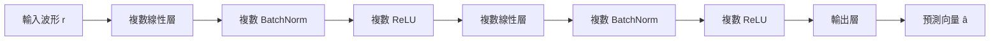
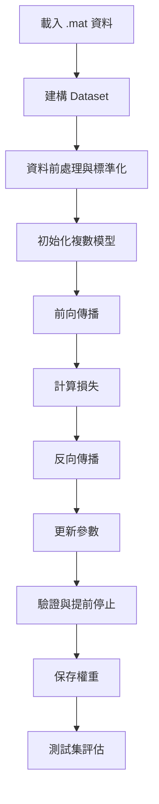

# CVNN：複數波形回歸測試

## 1. 專案簡介

本專案測試一個典型的複數值回歸任務：給定接收端觀測到的一段複數波形 $\mathbf{r} \in \mathbb{C}^{L}$，模型需要預測對應的複數目標向量 $\mathbf{a} \in \mathbb{C}^{D}$。其中輸入長度為 $L=12000$，輸出維度為 $D=33$。

我們希望學習一個映射函數

$$
\hat{\mathbf{a}} = f_{\theta}(\mathbf{r})
$$

使輸出向量 $\hat{\mathbf{a}}$ 儘可能接近真實標註 $\mathbf{a}$。

這個問題可視為一個「由波形到參數」的監督式回歸問題，並具有複數輸入、複數輸出與雜訊干擾等特性。

---

## 2. 實驗參數與其意義

| 類別 | 參數 | 設定值 | 代表意義 |
| --- | --- | --- | --- |
| 輸入長度 | $L$ | 12000 | 每筆輸入波形包含 12000 個時間點(取樣點)，代表模型一次要處理的高維複數訊號長度。此數字直接決定第一層線性層的輸入維度。 |
| 輸出維度 | $D$ | 33 | 模型要預測的複數目標向量長度。每一維都對應一個要回歸的複數參數。 |
| 訓練樣本數 | $N_{\mathrm{train}}$ | 最多 3000 | 用於學習的訓練樣本上限。樣本越多，模型越容易學到穩定的映射關係，但計算成本也會增加。 |
| 測試樣本數 | $N_{\mathrm{test}}$ | 1500 | 用於最終評估的未見過資料數量。這些樣本不參與訓練，能更真實地反映泛化能力。 |
| SNR 條件 | | $\{0,5,10,15,20,25\}$ dB | 訊雜比設定，數字越小表示雜訊越強、任務越困難。模型在不同 SNR 下都要維持良好的重建能力。 |
| 批次大小 | $B$ | 256 | 每次更新參數時一次處理的樣本數。較大批次可使梯度更穩定，但會消耗更多記憶體。 |
| 訓練輪數 | $E$ | 25（預設） | 完整遍歷整個訓練集的次數。過多輪數可能導致過擬合，過少則可能不足以收斂。 |
| 學習率 | $\eta$ | $2 \times 10^{-4}$ | 優化器每一步更新參數的步長。過大容易震盪，過小則收斂緩慢。 |
| 權重衰減 | $\lambda$ | $1 \times 10^{-5}$ | L2 正則化強度，用來抑制參數過大、降低過擬合的風險。 |
| 驗證集比例 | | 0.1 | 從訓練資料中保留 10% 作為驗證集，用來監測是否出現過擬合並決定提前停止。 |
| 隨機種子 | | 42 | 固定隨機種子，確保每次實驗在相同條件下可重現。 |

---

## 3. 輸入輸出定義

輸入訊號為一個長度為 $L$ 的複數向量：

$$
\mathbf{r} = [r_1, r_2, \dots, r_L] \in \mathbb{C}^{L}
$$

輸出為一個 $D$ 維複數向量：

$$
\mathbf{a} = [a_1, a_2, \dots, a_D] \in \mathbb{C}^{D}
$$


目標是學習參數化函數 $f_{\theta}$，使得

$$
\|\hat{\mathbf{a}} - \mathbf{a}\|_2
$$

盡可能小。

---

## 4. 資料輸入輸出建模

### 4.1 複數表示

任一複數值可表示為

$$
z = x + jy
$$

其中 $x = \Re(z)$ 是實部， $y = \Im(z)$ 是虛部， $j$ 為虛數單位。對長度為 $L$ 的複數波形而言，可寫成

$$
\mathbf{r} = [r_1, r_2, \dots, r_L]^\top,
\quad r_l \in \mathbb{C}
$$

實作時，模型並不是把複數簡化成單一實值，而是保留實部與虛部的雙通道結構，讓模型同時學習幅度與相位資訊。

### 4.2 輸入與輸出映射
模型的核心是學習一個複數回歸映射：

$$
f_{\theta}: \mathbb{C}^{12000} \rightarrow \mathbb{C}^{33}
$$

也就是將接收波形 $\mathbf{r}$ 映射成目標向量 $\mathbf{a}$ 的估計值 $\hat{\mathbf{a}}$。這裡的 $\theta$ 代表所有可訓練參數，包括複數線性層、複數批次正規化層與偏置項。

### 4.3 訊號模型

資料生成過程可建模為

$$
\mathbf{r} = \mathbf{s} + \mathbf{n}
$$

其中 $\mathbf{s}$ 表示理想訊號， $\mathbf{n}$ 表示加性高斯雜訊。這個假設的意義在於：模型不能只記住乾淨訊號的模式，還必須學會在雜訊干擾下恢復潛在結構，因此輸入端的魯棒性非常重要。


---

## 5. 資料集與前處理

### 5.1 資料集內容

每筆樣本包含三個主要欄位：

- `rx`：接收訊號（複數波形）
- `a`：目標向量（複數）
- `snr`：對應訊雜比

### 5.2 資料來源

資料由 [ml.py](ml.py) 生成，並由 [train.py](train.py) 載入。資料涵蓋多個 SNR 等級，包括：

- 0 dB
- 5 dB
- 10 dB
- 15 dB
- 20 dB
- 25 dB

### 5.3 前處理

訓練前，模型會對輸入與目標的實部與虛部分別進行標準化，避免不同特徵尺度造成訓練不穩定。

---

## 6. 模型架構

有別於將複數化為實數做處理的MLP，本專案將採用複數值神經網路 `torch.complex64` 。

### 6.1 架構圖


```mermaid
flowchart LR
    A[輸入波形 r] --> B[複數線性層]
    B --> C[複數 BatchNorm]
    C --> D[複數 ReLU]
    D --> E[複數線性層]
    E --> F[複數 BatchNorm]
    F --> G[複數 ReLU]
    G --> H[輸出層]
    H --> I[預測向量 â]
```

### 6. 模型層次
 
### 6.1 核心複數層
 
| 層 | 數學定義 | 備註 |
|---|---|---|
| `ComplexLinear` ：複數線性層 | $y_j = \sum_i x_i \overline{W_{ji}} + b_j$ | $\overline{W_{ji}}$ 權重W為共軛轉置（Hermitian 內積），對應訊號處理中的匹配濾波慣例 |
| `ComplexBatchNorm1d` ：複數批次正規化 | $\hat{x} = \dfrac{x-\mu}{\sqrt{\mathbb{E}[\lvert x-\mu\rvert^2]+\epsilon}}$ | **簡化版**：只用純量方差正規化，假設訊號圓對稱（實部虛部不相關、方差相等）。理論上需對 2×2 協方差矩陣白化，但這裡沒有實作 |
| `ComplexReLU` ：複數域中的非線性激活 | $\phi(x) = \mathrm{ReLU}(\Re x) + i\cdot\mathrm{ReLU}(\Im x)$ | 實部虛部分別做 ReLU |
 
### 6.2 架構
 
$$
L \quad \xrightarrow{\text{CLinear}} \quad 384 \quad \xrightarrow{\text{CBN CReLU}} \quad 192 \quad \xrightarrow{\text{CBN CReLU}} \quad \xrightarrow{\text{CLinear}} \quad D
$$
 
前向傳播：

$$
\hat{\mathbf{a}} = f_{\theta}(\mathbf{r}) = L_3(\phi(B_2(L_2(\phi(B_1(L_1(\mathbf{r})))))))
$$

其中 $L_k$ 表示複數線性層， $B_k$ 表示複數批次正規化， $\phi$ 表示複數 ReLU。這個分層設計的作用如下：

- 第一層把高維輸入壓縮成較低維的抽象表示，降低原始波形的冗餘
- 中間層進一步提取與目標向量相關的複數特徵

相較於直接使用單層線性回歸，這種多層結構能夠學到更非線性的訊號到參數映射。

---
 
## 7. 損失函數
 
$$
\mathcal{L} = 0.4\,\mathrm{MSE}(\Re\hat{\mathbf{a}}, \Re\mathbf{a})
            + 0.4\,\mathrm{MSE}(\Im\hat{\mathbf{a}}, \Im\mathbf{a})
            + 0.15\,\mathrm{MSE}(|\hat{\mathbf{a}}|, |\mathbf{a}|)
            + 0.05\,\mathbb{E}\big[|\hat{\mathbf{a}}-\mathbf{a}|\big]
$$
 
四個權重是人工設定，還沒有做過自動搜尋或消融實驗去驗證這組權重是否最佳。
 
---
 
## 8. 訓練與梯度處理
 
- 優化器：`AdamW`，權重衰減 $1\times10^{-5}$
- 沒有學習率排程（LR 全程固定，預設 $2\times10^{-4}$）
- 手動實作複數梯度裁剪：因為 PyTorch 原生 `clip_grad_norm_` 對複數張量支援
  不完整，改為手動計算 $\|\nabla\|=\sqrt{\|\Re\nabla\|_2^2+\|\Im\nabla\|_2^2}$
  做 global-norm 裁剪，裁剪後呼叫 `resolve_conj()` 避免 PyTorch 複數梯度的
  lazy conjugate view 在 in-place 操作時出錯
兩種方法的訓練超參數（epochs、學習率、batch size）完全相同，唯一差異是
「餵進去的訓練樣本 SNR 範圍不同」。
 
---
 
## 9. 統計方法：多重種子、mean ± std
 
為了避免「跑一次就下結論」的問題，`train.py` 對每個方法用
`--n-seeds`（預設 3）個獨立種子（控制模型初始化與訓練時的 shuffle）各跑
一次，最終每個 SNR bin 的 MSE / MAE / EVM 都輸出 **mean ± std**。
 
評估指標：
 
- **MSE**： $\mathbb{E}[|\hat{\mathbf{a}}-\mathbf{a}|^2]$
- **MAE**： $\mathbb{E}[|\hat{\mathbf{a}}-\mathbf{a}|]$
- **EVM (dB)**： $10\log_{10}\left(\dfrac{\mathbb{E}[|\hat{\mathbf{a}}-\mathbf{a}|^2]}{\mathbb{E}[|\mathbf{a}|^2]}\right)$，
  通訊系統常用的訊號重建品質指標
按 SNR bin（`round()` 到整數 dB）分組統計，可以直接看出「High-SNR-only
模型在低 SNR 區間衰退了多少」以及「All-SNR 模型在高 SNR 區間是否有犧牲一些
精度」這兩個核心問題的答案。
 

---

## 10. 訓練流程圖


```mermaid
flowchart TD
    A[載入 .mat 資料] --> B[建構 Dataset]
    B --> C[資料前處理與標準化]
    C --> D[初始化複數模型]
    D --> E[前向傳播]
    E --> F[計算損失]
    F --> G[反向傳播]
    G --> H[更新參數]
    H --> I[驗證與提前停止]
    I --> J[保存權重]
    J --> K[測試集評估]
```

### 10.1 詳細流程

1. 讀入 MATLAB 格式資料
2. 建構訓練集與驗證集
3. 對輸入與目標做標準化
4. 初始化複數模型
5. 進行前向傳播與損失計算
6. 反向傳播與參數更新
7. 使用驗證集檢查收斂情況
8. 最終保存最佳權重並進行測試評估

### 10.2 訓練策略說明

訓練階段的設計重點不是單純讓損失下降，而是讓模型在複數資料上穩定收斂。具體來說：

- `AdamW` 同時提供自適應更新與權重衰減，適合這類高維非線性回歸問題
- `CosineAnnealingLR` 會隨 epoch 漸進降低學習率，使前期探索更快、後期收斂更穩
- 驗證集比例 0.1 用來監控泛化能力，避免訓練集上表現變好但測試集退化
- 提前停止策略會在驗證損失連續多輪未改善時停止訓練，以避免過擬合與無效計算
- 參數梯度會做額外的尺度正規化，降低某些複數參數梯度過大的風險，讓更新步伐更一致

---

## 11. torch API

### 11.1 輸入

```python
x: torch.Tensor
```

- 形狀：`[batch_size, 12000]`
- 類型：`torch.complex64`
- 含義：一批接收波形樣本

### 11.2 輸出

```python
y: torch.Tensor
```

- 形狀：`[batch_size, 33]`
- 類型：`torch.complex64`
- 含義：對應的目標向量預測值

### 11.3 推論範例

```python
import torch
from train import WaveformRegressor

model = WaveformRegressor(12000, 33)
x = torch.randn(2, 12000, dtype=torch.complex64)
y = model(x)
print(y.shape)
print(y.dtype)
```

---

## 12. 實驗結果

在 1500 個測試樣本，Epoch = 25 的實驗結果如下：

| 指標 | 數值 |
| --- | ---: |
| Average MSE | 0.030337 |
| Average MAE | 0.109154 |
| Average RMSE | 0.123704 |
| Average EVM (dB) | -19.97 dB |
| Correlation | 0.767656 |

這些結果顯示模型已具備基礎的重建能力，能在目前的合成資料設定下較穩定地估計目標向量。

---


## 11. 專案結構

```text
ML/
├── ml.py
├── train.py
├── README.md
├── checkpoint/
└── data/
```

- [ml.py](ml.py)：生成複數波形資料集
- [train.py](train.py)：載入資料、訓練模型並進行評估
- [README.md](README.md)：專案說明與實驗記錄
- [checkpoint](checkpoint)：模型權重檔案
- [data](data)：生成的 MATLAB 資料檔

---

## 12. 執行方式

### 生成資料

```bash
python ml.py
```

### 訓練與評估

```bash
python train.py
```

也支援命令列參數，例如：

```bash
python train.py --epochs 25 --batch-size 256 --max-samples 3000 --test-samples 1500
```

---

## 13. 限制與未來方向

目前仍有幾個值得進一步探索的方向：

- 目前資料為合成資料，尚未驗證於實際量測資料
- 模型結構仍以簡單的多層感知機為主
- 未來可進一步研究不同 SNR 條件下的泛化能力與魯棒性
- 也可以嘗試引入複數多層感知機（Complex MLP）或 複數卷積網路（Complex CNN）以提升性能。

---

